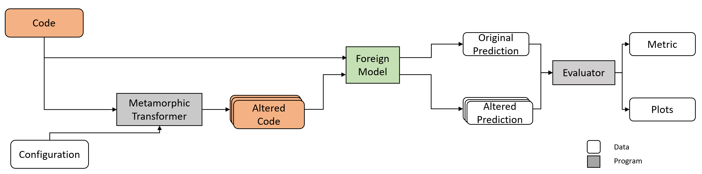

# Lampion

This project aims to help you with explainability and robustness of your Codebased ML-Models.
It is based on the idea of [Metamorphic Transformations](https://en.wikipedia.org/wiki/Metamorphic_code) which alter the code-syntax but keep the meaning of the code.
When applied to bytecode, this is often called *Obfuscation*, and examples are changing variablesnames or introducing dead code.

The provided Java-Transformer is configurable to provide a number of metamorphic transformations on SourceCode. 
We aim to be highly configurable and extendable for further research. 
A Transformer for Python is currently in the making.



## Getting Started

Further information as well as instructions on the components can be in their sub-folders. 
Any experiment-reproduction code is placed in a seperate repository, to which the items in *Experiments* will guide you.
An overview and reasoning on the structure can be found in the [Design-Notes](./Resources/DesignNotes.md).

The folder *Manifest-Schema* holds sql-files to generate a valid schema required for visualisation. (Currently not used, sorry I sometimes overengineer)

General information on design decisions can be found in the [Design-Notes](./Resources/DesignNotes.md).

Examples and reasoning on the metamorphic transformations can be found in [Transformations.md](./Resources/Transformations.md).

## Related & Similar Work

The Paper [Embedding Java Classes with code2vec: Improvements from Variable Obfuscation](https://arxiv.org/pdf/2004.02942.pdf) and it's accompanying [repository](https://github.com/basedrhys/obfuscated-code2vec) investigate the impact of changing variable names on the performance / robustness of Code2Vec based models.
With variable renaming being a subset of this work, it can be seen as related work with a different goal.
Another similar work is from [the code2vec authors](https://github.com/tech-srl/code2vec) with their paper [Adversarial Examples for Models of Code](https://arxiv.org/pdf/1910.07517.pdf).
In their paper they use common adversarial generation to create certain (wrong) predictions by changing variable names or introducing newly, unused variables. 
This is another sub-part of this project, but instead of going for explainability they go straight for exploits on the system.

A very close related work is done by [Rabin et al](https://www.sciencedirect.com/science/article/abs/pii/S0950584921000379?via%3Dihub) and is also available [on Github](https://github.com/mdrafiqulrabin/tnpa-generalizability). They have the same motivation and nearly identical approach, we only differ in experiment and evaluation. Sometimes the world is a strange place, that we both made it through reviews in parallel. 
Another related work is by [Cito et al](https://arxiv.org/abs/2111.05711), where they use a language model to produce prediction-changing differences that are still human-readable. 
As far as I understood, the counterexamples do not necessarily have the same functionalities and are just for explainability. 

A more precise differentiation and further work can be found in [our publication](https://research.tudelft.nl/en/publications/assessing-robustness-of-ml-based-program-analysis-tools-using-met).

## Citing 

If you want to cite this paper or repository, please use the following: 
```bibtex
    @inproceedings{applis2021,
    title = "Assessing Robustness of ML-Based Program Analysis Tools using Metamorphic Program Transformations",
    keywords = "Metamorphic Testing, Machine Learning, Documentation Generation, Code-To-Text, Deep learning",
    author = "L.H. Applis and A. Panichella and {van Deursen}, A.",
    year = "2021",
    month = sep,
    booktitle = "IEEE/ACM International Conference on Automated Software Engineering - NIER Track",
    publisher = "IEEE / ACM",
    }
```