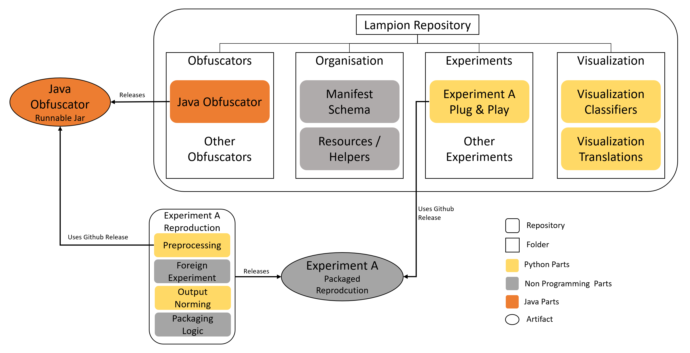

# Design Notes

This file holds some considerations for the implementation details that occurred throughout the project.

## Naming 

A short dictionary to understand names and namings in this project: 

- **AST**: [Abstract Syntax Tree](https://en.wikipedia.org/wiki/Abstract_syntax_tree) - a representation of the code and program produces by a compiler. The ASTs in this project are provided by the [Spoon Library](https://github.com/INRIA/spoon/). 
- **Metamorphic Transformations**: A metamorphic transformation originates from machine vision, where initially the images get flipped, rotated or noised in order to test/improve the model under test. The initial image is still the same for humans, and has the same degree of information (e.g. it is still a dog on the picture, even if it's turned upside down). This behavior is transferred to code and models working on code, for quick-examples see [The overview image](./ExampleTransformations.PNG) or [more elaborate definitions](./Transformations.md). The term *"metamorphic transformation"* and *"transformation"* are used interchangeably in this project, as there are no other transformations.
- **Obfuscation**: Refers to altering program (mostly byte) code to make a program effectively equal but different in representation on disk/file. This is commonly used to mask malware and pass virus-scanners. The obfuscations applied are usually metamorphic transformations on bytecode-level.

## Big Refactorings 

- From v1.1: Changed "Obfuscator" in all occasions to "Transformer", to fit closer to the processes described in the paper. The Term Obfuscator was still part of the experiments provided in the paper, however, I then decided to change it. 

## Repository Structure

In terms of the optimal repository structure, it is important to see the components of this project as a whole, where there are 

1. self-written Transformers
2. an output specification (Manifest-Schema)
3. Foreign Experiments, to conduct a meta experiment
4. Visualization, to evaluate the meta experiment

Where each part has different inputs and outputs:

Transformers are program code, should be versioned, should use shared data (the manifest) and be published.

The Manifest-Schema is only shared data between transformers and visualization.
While it goes into a sql-lite database, there is no such thing as a docker image provided.

The foreign experiments, need (foreign) data and return data (such as metrics). 
Furthermore, the foreign experiments need some buildup to put the transformers to work, and to norm the metrics in a usable format.

The vizualisation needs the produced data from the manifest, as well as the metrics from the experiments.

In terms of expressing this in a structure, there are two opposing goals: 

1. neatly seperate the parts, so they can be versioned, published and cared for in partition.
2. keep the parts together, to reduce integration and the partition of information

Also, some parts are self-sufficient (like the transformers), but others do not make sense on their own (like the manifest).

For now, the following structure will be pursued: 



That is, most artifacts are in the Lampion repository (this one), but the experiments are separated into an extra repository. 
The extra repository needs the transformers from this repositories-releases, and builds a fully reproducible, self-contained package.
This experiment-package is used in Lampions-repository's Experiment folder, with references and experiment-specific configuration.
The combination of configuration + reproduction-package-version should yield a definite and clean result, as well as (the for now) best architecture.
It should also help to accomodate different configrations and the switch to different/later versions of the transformers.

## Alternation Manifest

### Representation on Disk

For the alternation manifest, it should have a list of entries where each entry should have:

- A (fully qualified) methodname
- A (fully qualified) classname
- A list of Transformations

Where each Transformation should have:

- A name / type
- A set of categories it belongs to
- A scope
- A "Before <-> After" of the code, at least for debugging purposes.

The initial idea for a recording the transformations was a (simple) file in either CSV or JSON.
However, the categories which are of variable length break CSVs (in a nice way).
And JSON, while human readable, has an explosion in size and as big-data amounts are to be expected, storing millions of records as JSON is a bad idea.
The same reasoning applies to (plain) xml.

Hence, the data needs to be compressible and support variable length inputs.
Candidates would be binary-serialized xml or Binary-JSON in a compressed format.
Another more exotic candidate would be Java-Serialization of the objects, however then the visualisation is also bound to Java.
As I do not want to poke around in binary data with python, a different idea has been chosen:

**SQL & SQLite.**

SQLLite is fast, everywhere and supports the required schema in a good way.
SQLLite comes with a build in compression.

There are two further benefits:

- When only using standard SQL and ODBC, the transformers can store the manifest in a remote library
- Some queries can be performed on the database, saving time in python

The negative point in using SQL is that it is compared to a file a lot of additional work for both sides, visualisation and writing.

### Enum vs. Strings for Categories

When implementing the Categories in Java, I decided to go for an enumeration instead of a `Set<String>` to implement the categories for the results. 
This was done to have documentation on the categories in a single place (the enum file) as well as to miss out typos. 
Hence, it seems like a good approach. 

For the SQL file, it could be possible to store the categories as enums as well. 
The issue with this is, that whenever there is a transformation implemented with a new category, the database will need to change as well. 
And, furthermore, older databases will be unusable with the current version. 

After the data is in the SQL Database, it will be used "read only" anyway, so the additional safety provided by enums is not necessary. 

Therefore, the transformer instantiates the categories table of the database with all categories found in its enumeration and linking the entries to the categories table instead of using an database-enumeration.
This approach helps to be a bit more flexible in terms of the database and also helps to re-use the schema for more and different transformers. (Let's say you write another transformer in Python with different Categories, then you'd have to sync the enum over java, python and sql)

*See:*

- [TransformationCategory.java](../Transformers/Java/src/main/java/com/github/ciselab/lampion/transformations/TransformationCategory.java)

## Transformer

### Registration of Transformers

For the Transformations I'd have liked to have a single class per Transformation with a shared interface.
That is all fun and games until it comes to randomly picking a Transformation.

If another component needs to pick amongst all available Transformations, there must be either

- A concept where each Transformation self-registers in an entity
- An Entity knows all available Transformations (God Class)

Both have up and downsides:

The Self-Registering will be more decentralized, sticking closer to object oriented standards (each class is responsible for it's registration).
However, using the self-registered transformations will require the use of reflections, which is horrible to test and hard to understand.

The God-Class breaks with responsibilities and can grow immensely large.
On the other side, it's easier to spot issues and test it, as well as it's easier to get started with in the first place.

**At the moment the God Class is chosen**, as in the first prototypes there will be little to no issues with size and only a few Transformations implemented.

**Update:** Apart from the initial thoughts, a compromise has been chosen. The initial thoughts are kept for now to show the reasoning.
Instead of implementing *Transformations* now implemented are *Transformers*. 
These Transformers can be build and scoped by need and can be registered in a central entity. 
Every Transformer has a static method that registers itself in a Transformer Registry. 
Then all the ugly parts of reflections are dodged, and the parts of the God Class can be tested easier. 

This also enables to have a registry-class, where the App has one central registry from system startup or initializes a registry according to configuration. With the registry being an object, it breaks with the issues of the God-Class and enhances testing.

**Update 2:** The above given update of having the static delegate has been discarded. 
The issue was, that the static delegates of the Transformers are loaded at class-load time. However, the App does not touch (all) of the Transformer classes by default.
Without further tricks, the App would run without having a single Transformer in the Registry.

To avoid this, some nasty tricks would have need to be done: Either invoking reflections upon the transformer package and look at all classes, which will trigger static time code, or semi-manually touch all Transformers in the App. 
This means that the reflection-part still would be necessary, which is in addition to the more complex delegate method rather a lot of mental overload. 
This is why, for now, simply a default registry is added with a few constructor calls, and all reflection and static logic has been removed.
At least it is simple, and for every transformer about 7 Lines must be added to the *App.java*. 

*See:*

- [Transformation.java](../Transformers/Java/src/main/java/com/github/ciselab/lampion/transformations/Transformer.java)
- [TransformationRegistry.java](../Transformers/Java/src/main/java/com/github/ciselab/lampion/transformations/TransformationRegistry.java)

### Attributes of Transformations

Transformations come with a variety of possible attributes,
but to have a nicely configurable program it's important to address them probably.

Each Transformation has

- A (unique) name
- A set of categories (such as NLP-Relevant, Structure-Relevant, ...)
- Whether it is (likely to be) a Code-Smell
- Whether it is (likely) to affect generated Bytecode
- A set of Transformations to which it is exclusive
- A set of sanity-checks whether it is applicable

Some Transformations are diametric to each other and hence useless when applied after each other, examples are removing comments versus duplicating comments.
Some Transformations are exclusive to themselves, that is e.g. changing a method name twice does not make sense.

Sanity checks are a super set of exclusiveness-checks and cover things such as that you can't alter variable names for a method that has no variables.
For any `Transformation<T>` the sanity checks can be expressed as a `Set<Predicate<T>>`.

These Attributes should enable a managing component to

1. pick only valid, none code breaking, Transformations for any method
2. pick Transformations based on a specified distribution

## TroubleShooting / Error Registry 

This section holds some of the issues encountered.

### Missing Spoon Parents

Some of the position-parts of the SQLiteWriter failed, due to the TransformedElements having no parent. 

This originates from the `CtElement::clone`-method which does not copy the parent.
The likely reason for this is that spoon will have some internal logic where the children are used for building and processing items.
It did not appear on pretty printing, so it seems to be non-malicious for what this project needs.

To work around this, take care of setting the parent to the clone.

### SQLite cannot do Multiple Statements

When working with SQLite, an issue occured that the schema could not be written from a single file. 
Reason for this is that SQLite does not support multiple statements in a single query. 

As a workaround, the file gets separated by `;` and every statement is run after each other. 

The only databases which seem to support multi-statements are MariaDB/MySQL and Microsoft SQL.

### The logging disappeared for the jar

The logic with Log4J, Slf4j and shading a jar is not that easy. 

Usually I just use Log4j and everything is happy times, but the Spoon library came with their own SLF4j conform logging. 
When (naively) building a jar using maven assembly plugin, it broke the jar because of double binding on slf4j. 
That's why I moved to the shaded-jar-plugin, which made the build successful again but removed the logging. 
The app just warned that there were no SLF4J bindings found and continued quiet.

After a lot of trial and error, the following dependencies must be somewhere in maven: 
- SLF4J Core
- SLF4J Simple
- Log4J
- Log4J-SLF4J Binding

I am not 100% sure whether some of these can be removed, however now it is working with logging for both spoon and the java transformer.

## Miscellancelous 

### Anonymus Shading of Java Transformers

For the paper it was necessary to anonymize the Obfuscator, 
which had an issue as the logging contained the class path, which had "ciselab" in it. 
To fix this, add the following in the Mavens Shading pluggin: 

```XML
<configuration>
    <!-- This should (?) rename the  artifacts to be anonymous-->
    <!-- taken from https://maven.apache.org/plugins/maven-shade-plugin/examples/class-relocation.html -->
    <relocations>
        <relocation>
            <pattern>com.github.ciselab.lampion</pattern>
            <shadedPattern>anonymous.lampion</shadedPattern>
        </relocation>
    </relocations>
    <!-- This transformer is necessary, as otherwise the current Spoon version breaks on runtime missing a Logger -->
    <!-- See: https://github.com/INRIA/spoon/pull/3678 -->
    <transformers>
        <transformer implementation="org.apache.maven.plugins.shade.resource.ManifestResourceTransformer">
            <mainClass>anonymous.lampion.program.App</mainClass>
            <manifestEntries>
                <Multi-Release>true</Multi-Release>
            </manifestEntries>
        </transformer>
        <transformer implementation="org.apache.maven.plugins.shade.resource.ServicesResourceTransformer"/>
    </transformers>
</configuration>
```
